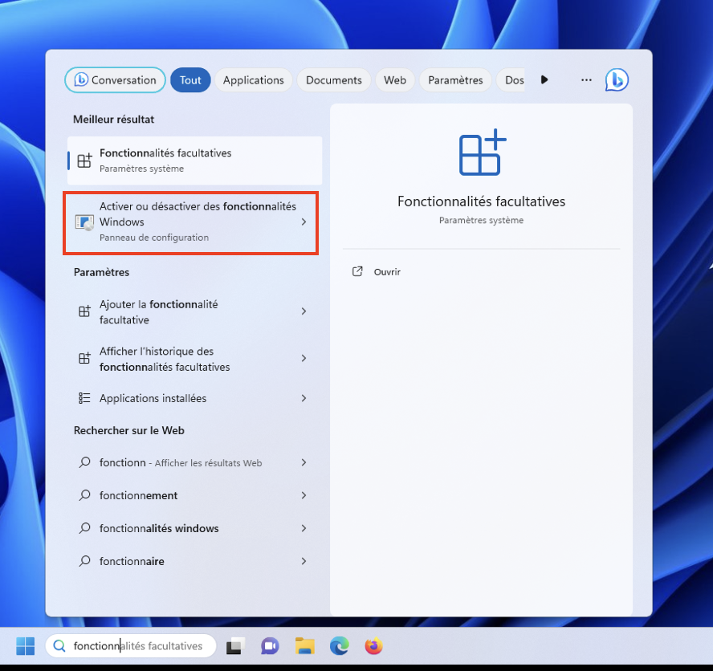
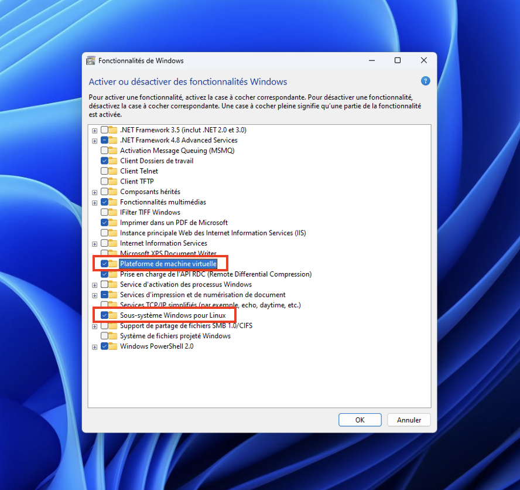
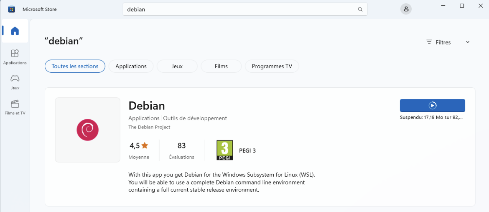
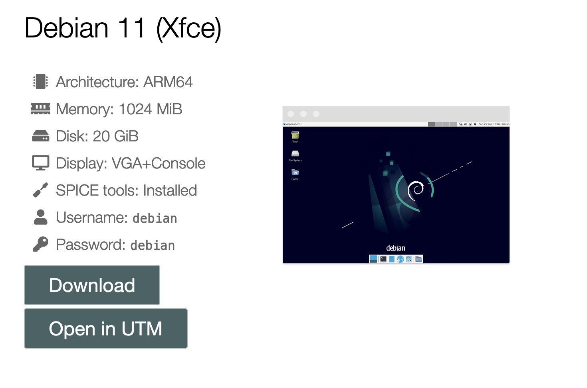
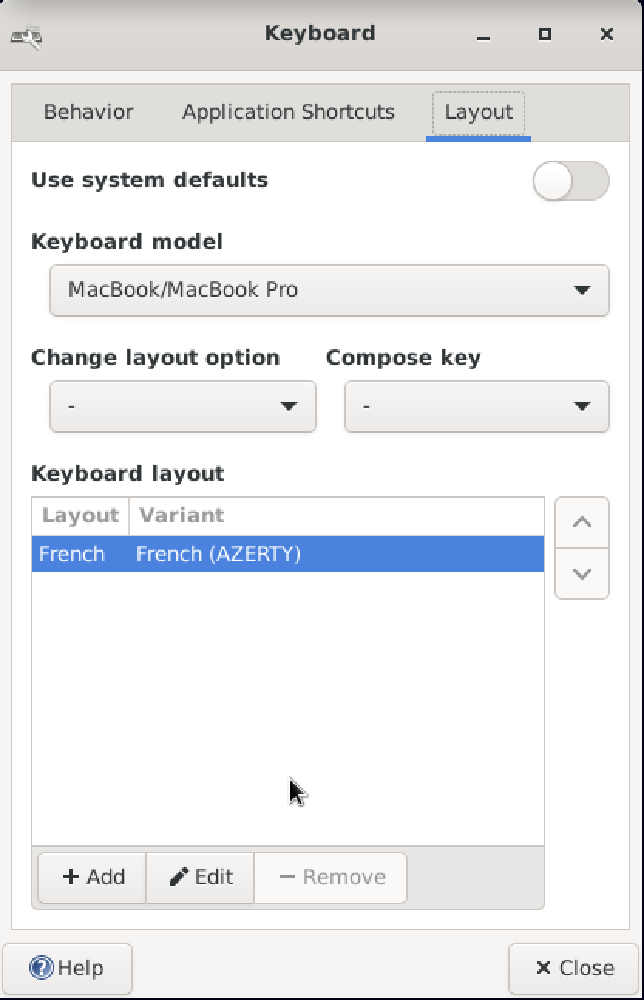
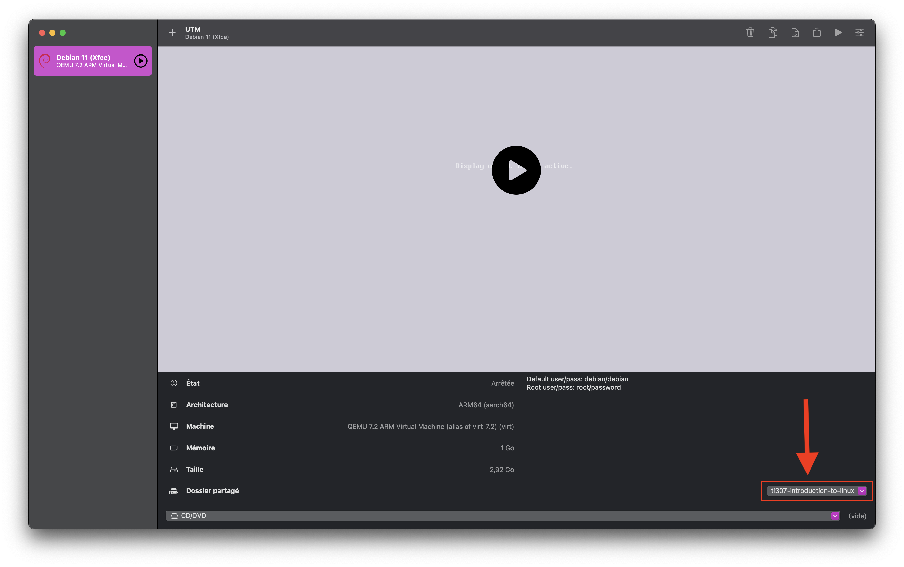

# Get yourself a Linux environment

## Installation of WSL (for Windows users)

In this tutorial we will see how you can directly have a Linux environment in Windows using *Windows Subsystem for Linux* (WSL).

### WSL activation
1. In the search bar of Windows, type *"Activer ou désactiver des Fonctionnalités Windows"*.

2. There will be a dialog box in which we will check options.
3. Make sure that the options **Sous-système Windows pour Linux** and **Plateforme de machine virtuelle** are checked and click on OK.

4. You will probably be asked to restart your computer for the changes to take effect.

### GNU/Linux distribution installation (Debian)
1. Open up *Microsoft Store* and type **debian** in the search bar. Once **Debian** is proposed in the suggestions, click on it.
2. Click on **Obtenir**.

3. Once the download is finished (about 80MB), search for Debian in the Windows search bar and click on it.
4. A terminal emulator named *Debian* will open and finalize the installation.
5. In this terminal, once the installation is finished, you will be asked to enter a username and a password. Note that for security reasons, the password you will type will not appear in clear, you may have the impression of not typing anything, but in fact yes.
6. Once your login and password have been entered, that's it! You now have a GNU/Linux system (command line) installed in Windows.

### Browse the WSL files from Windows
1. Open a file explorer from Windows.
2. In the adress bar, type: `\\wls$`, then press enter.
>> Capture fenêtre
3. From there, you will be able to access your personal directory by clicking on `home` then on the folder whose name is your `login`. 
4. From now, you are able to retrieve your debian files from Windows.
5. To test that everything is fine, in the debian terminal enter the following command: 
```bash
touch file.txt
```
then from the Windows file explorer check that the file has been created in your personal directory (you may need to refresh the window with `F5`).
6. Edit `file.txt` in a text editor from Windows, then save it.
>> Capture fenêtre
7. Finally, go back to the debian terminal to check that the file has been modified. Type the command:
```bash
cat file.txt
```
8. You may observe a small problem with the end of lines, Windows and Unix manage them differently (we will talk about it later).

### Install Debian packages with `apt`
Most of the GNU/Linux distributions allow to install programs, libraries (set of programs), precompiled software by going through online *repositories*. The programs and libraries present in these repositories are called *packages*.

The installation of these packages is performed by a ... *package manager*. Debian and its derivatives, the package manager is called `apt`.

Since those packages are installed on the system, for all users, only the system administrator is allowed to install them, but you will be able to take this role.

!!! note "`sudo` ?"
    The `sudo` command allows you to execute the command that follows it as an administrator. You will be asked for your password (once per session).

Let us install some packages.

1. First, update the database and the already installed packages by typing in your Debian terminal:
```bash
sudo apt update
sudo apt upgrade
```
This step may take more or less time depending on your internet connection.
2. Once the updates are done, we will install 4 packages: the text editors `nano` and `vim`, the c compiler `gcc`, and a calandar app `ncal` with the following command:
```bash
sudo apt install nano vim gcc ncal
```
3. It is also possible to search for packages by name or keyword using the `search` action of the `apt` command.
4. To remove / uninstall a package, use the `remove` action of the `apt` command:
```bash
sudo apt remove nano
```
5. Finally, some libraries become useless once the packages that used them are removed. The `autoremove` action allows you to clean up by uninstalling the libraries that have become useless.
```bash
sudo apt autoremove
```

## Installation of UTM (for MacOS users)

In this tutorial we will see how you can directly have a Linux environment in MacOS using *UTM*.

### UTM and Debian installation 

1. Download the UTM application from the App Store. Or directely from [here](https://mac.getutm.app/).
2. Open the application, there will be options to install and emulate an OS (Windows, Linux, Android, ...). We will choose Linux.
3. Click on the *Browse UTM gallery* button, it will open up the UTM Virtual OS gallery.
4. Choose one of the Debian 11 distribution of your choice (for this tuto I choose the one with Xfce graphical environment).
   
   <!--  -->

5. Then click on *Open in UTM* button, this will download the image and install Debian on your computer.
6. Once the installation is finished, get back to the UTM application, you will see the Debian OS in the list of the installed OS.
7. Click on the Debian OS, then click on the *Play* button.
8. You will end up in a login page, enter your username and password (the default username is `debian` and the default password is `debian`).
9.  Pay attention to the keyboard layout, it may be different from the one you are used to. It is by default the QWERTY keyboard layout.

### Keyboard layout change

1. To change the keyboard layout, click on the *Applications* button on the top left corner of the screen. 
2. There will be a list of applications, click on the *Settings* application, then on *Keyboard*.
3. You will have a window with the keyboard settings, click on the *Layout* tab.
4. From there, change the keyboard model to *MacBook/MacBook Pro* and on the keyboard layout option, click on the *Add* button choose the one you are used to (for me it is *French (AZERTY)*).
5. You can by now delete the default keyboard layout which was the QWERTY one.
6. At the end of the configuration you should end up with something similar to this:
   

7. You can close the window, and now you can use the keyboard layout you are used to.

    !!! warning "On the login screen"
        On the login screen the keyboard layout will remain the default one i.e. QWERTY. So you will have to type your password with the QWERTY layout.

### Sharing MacOs folder with your Debian OS

For this step, you will need to have a folder in your MacOS that you want to share with your Debian OS. For this tutorial, I will use a folder named `ti307-introduction-to-linux`.

1. First you need to turn off the Debian OS by clicking on the *Stop* button in the UTM application.
2. Then right click on Debian OS on the list of the installed OS, and click on the *Edit* button.
3. You will have several options to configure your OS, we will focus on the *Share* option.
4. Click on *Share* option, and browse then select the folder you want to share from your MacOS. Let the other options as they are.
5. At the end of this step your Debian OS configuration should be similar to this:

    

6. Now you can turn on your Debian OS by clicking on the *Play* button.
7. Log in, then on your desktop you should find a *Volume Disk* named `share`. Double click on it and you should retrieve the folder you shared from MacOS.
8. In this file explorer window, right click and choose *Open in Terminal Here*. Then type the following command:
```bash
sudo touch file.txt
```

    !!! note "`sudo` ?"
        The `sudo` command allows you to execute the command that follows it as an administrator. You will be asked for your password (once per session).

1. Get back into your MacOs file explorer, you should find the file `file.txt` in the folder you shared. Then from there, edit this file using a text editor.
2. Get back to the Debian terminal, and type the following command:
```bash
sudo cat file.txt
```
If you are able to see on the terminal the content of `file.txt`, everything went right and from now you can share files between MacOS and Debian.

    !!! tip "Path to the shared directory"
        In the Debian OS, the path to the shared directory is `/media/share`. Make sure that you remember this :)


### Install Debian packages with `apt`
Most of the GNU/Linux distributions allow to install programs, libraries (set of programs), precompiled software by going through online *repositories*. The programs and libraries present in these repositories are called *packages*.

The installation of these packages is performed by a ... *package manager*. Debian and its derivatives, the package manager is called `apt`.

Since those packages are installed on the system, for all users, only the system administrator is allowed to install them, but you will be able to take this role.

Let us install some packages.

1. Open up a terminal. And first, update the database and the already installed packages by typing:
```bash
sudo apt update
sudo apt upgrade
```
This step may take more or less time depending on your internet connection.
2. Once the updates are done, we will install 4 packages: the text editors `nano` and `vim`, the c compiler `gcc` and a calandar app `ncal` with the following command:
```bash
sudo apt install nano vim gcc ncal
```
3. It is also possible to search for packages by name or keyword using the `search` action of the `apt` command.
4. To remove / uninstall a package, use the `remove` action of the `apt` command:
```bash
sudo apt remove nano
```
5. Finally, some libraries become useless once the packages that used them are removed. The `autoremove` action allows you to clean up by uninstalling the libraries that have become useless.
```bash
sudo apt autoremove
```


