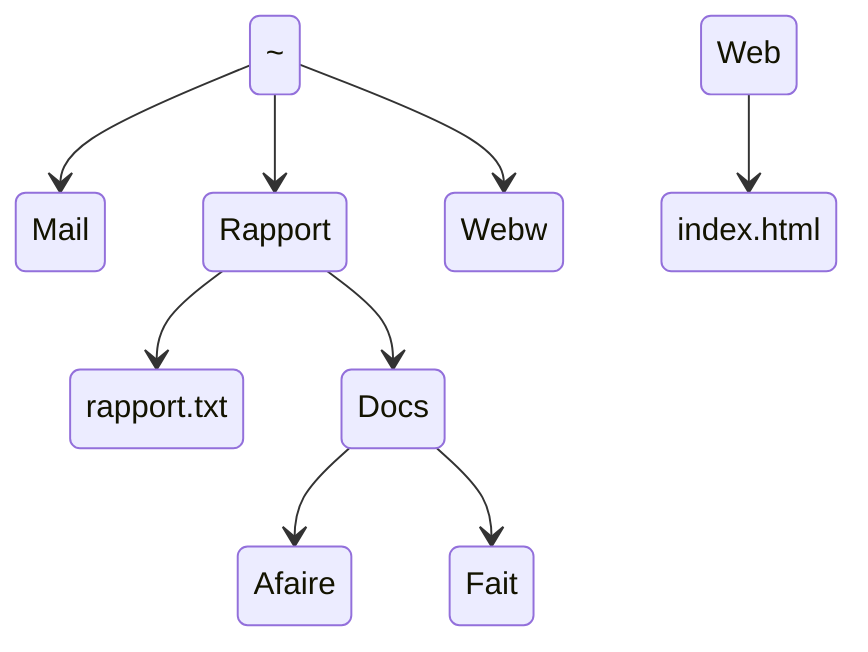

# Lab1 - First commands

!!! info "General instructions"
    
        - In all exercises, the `$ ` chain at the beginning of the line represents the command prompt and should not be typed.
        - For now, each time you open a terminal, you are prompted to enter the following command, (followed, as always, by the enter key) for pedagogical reasons:

        ```bash
        $ PS1='$ '
        ```

### Exercise 1 : First commands

!!! tip "What is a command ?"

    A *command*  is a sequence of words ending with a newline character. That is, a command is a sequence of characters that ends with the `<Enter>` key. The first word is the name of the command, the others are its *arguments*. The command is executed by the shell, which is a program that interprets the command line.

    ```bash
    $ touch file.txt
    ```
    
    Here the command is `touch` and its argument is `file.txt`. The `$` sign at the begining of the line is the command prompt. It is not part of the command.

    Every single word in the command line is separated by one or more spaces. The shell interprets the spaces as separators between words. The shell interprets the newline character as the end of the command.

1. Try out the following commands in a terminal. Describe in one sentence its usefulness, indicate the name of the command, its number of arguments and its arguments. For example, the first command is `date`, it has no argument and its usefulness is to display the current date and time.
```bash
$ date
$ cal
$ cal 3 2022
$ who
$ who am i
$   who  am   i
$ uname
$ uname -m -r
$ uname -mrs
$ echo Hello, world!
$ echo       Hello,        world!
```
2. Press on the right arrow key of your keyboard or `C-p` (the `Ctrl` key at the same time as the `p` key) several times, until the command `who` is displayed. Now press the down arrow key or type `C-n` until the command `uname -m -r` is displayed and then press enter. Note what these shortcuts are for and learn them.
3. Press `C-l`. Note what this shortcut is for and learn it.
4. Without explicitly write the command, display the command `cal 3 2022`, *without executing it* (i.e. without pressing enter).
5. Press `C-u`. Note what this shortcut is for and learn it.
6. Display again the command `uname`, without typing it nor executing it. Then press `C-d`. What happened ?
7. Clear the current command line with a keyboard shortcut and then type `C-d`. What happened ?
8. Open again a terminal and type `C-p` several times. Comment.
9.  Close the terminal using keyboard shortcuts.

### Exercise 2 : Directories and files

1. Open a terminal and type the following command, respecting its syntax:
```bash
PS1 = '$ '
```
2. Type the command `pwd` (for *print working directory*), that is, display the name of the current directory) and note what is printed on the screen: it is the absolute path of your *home*, personal directory.
3. Type the command `cd ..` (with a space between `cd` and `..`) and then `pwd`. Repeat these two commands several times until the result remains the same. What happened ?
4. Type the command `cd` (without argument), then `pwd`. Comment.
5. Type the command `cd /`, then `pwd` and `ls`.
6. Type the command `cd /usr/include`. Use the command `ls`. What does this directory seem to be used for ?
7. The `cat` command (for *concatenate*) displays one or more files given as arguments (one after the other) in the terminal. The `wc` command (for *word count*) displays (in this order) the number of lines, words and characters of the files given as arguments, then, if there are several, the sums of these numbers for all the files. Display the contents of the `stdlib.h` file and the number of lines of this file.
8. Type the commands `cd ..`, `pwd` and `ls`.
9. Type the commands `cd share/man`, then `pwd` and `ls`. Can you guess what some of the displayed results refer to ?
10. Type the command `ls /bin`. Are some of the names familiar to you ?
11. The **`~`** character (which is read *tilde*) is entered on the keyboard with the key combination `Alt Gr-2`. Enter the command `echo ~`, then the command `cd ~`. What did the shell do to the character `~` ?
12. Represent the directories and files mentioned in the exercise as a tree (i.e. as a genealogical tree).

### Exercise 3 : Manipulating directories and files (1)

!!! tip "Path access"
    
    A ressource (file or directory) is referenced by a *path*. In this path, under Linux, the names of the directories and files are separated by a slash `/` (while we use a backslash `\` under Windows).

    There exists two types of paths: absolute and relative.

    1. An *absolute* path is based on the root of the tree and starts with `/`, for example: `/home/debian` is the absolute path to the user debian's home directory. It remains valid regardless of the context.
    2. A *relative* path is relative to the current directory where the user is located. For example, if the current directory is `/home/debian`, the relative path `./Documents` refers to the directory `/home/debian/Documents`. A path that starts with something other than `/` or `~` is a relative path.

    The `.` references the current directory. The `..` references the parent directory.

1. Make sure you are in your home directory and list its contents.
2. Type the command `mkdir tp_shell` (for *make directory*, i.e. create a directory). List the contents of the home directory and the `tp_shell` directory.
3. Type the command `mkdir abeilles tp_shell/tp1 ~/arbres`. What did it do ? Among its arguments, which are absolute paths and which are relative paths ? (hint: see the result of `echo ~/arbres`).
4. What does the following command do ?
```bash
$ mkdir -p vivant/plante/fleur tp_shell/tp1/exos/ex1/
```
5. The `bash` shell (which is your default shell) has a feature that saves a lot of time and avoids typos: automatic completion. It is done with the tabulation key (the key to the left of the `a` key). Enter the following characters (the tabulation key is represented below by `<Tab>`) and see the result in the terminal:
```bash
$ mkd<Tab> vi<Tab><Tab><Tab>roses
```
6. When several choices are possible, tabulation does not trigger completion, but pressing the tabulation key twice in a row lists the possible choices: try with
```bash
$ ls a<Tab><Tab>
```
7. The `rmdir` command (for *remove directory*) allows you to delete directories. Test it with the command
```bash
$ rmdir vivant tp_shell/tp1/exos/ex1
```
and then delete the subdirectory `tp1` from the directory `tp_shell`.
8. The `touch` command allows (among other things) to create empty (normal) files. Observe the result of the command (executed from your home directory):
```bash
$ touch ~/arbres/hello.c abeilles/truc.txt bidule
```
by typing
```bash    
$ ls ~/arbres abeilles/ .
```
9. The `mv` command for *move*, allows you to move or rename files. Observe with `ls` the result of each of the following commands:
```bash
$ mv arbres/hello.c arbres/bonjour.c
$ mv abeilles arbres vivant/
$ mv bidule vivant
$ mv vivant vie
```
10.   The `cp` command for *copy*, allows you to copy files and directories. Observe the result of the following commands:
```bash
$ cp vie/arbres/bonjour.c salut.c
$ mkdir copies
$ cp salut.c vie/abeilles/truc.txt copies
$ cp vie/bidule tp_shell copies
$ cp -R vie/bidule tp_shell copies
$ cp vie copie_vie
$ cp -R vie copie_vie
```
Describe the operation of the `cp` command, depending on whether its last argument is an existing directory or not and whether the `-R` option is present or not.        

11.  Finally, the `rm` command (for *remove*) allows you to delete files and directories. Observe the result of the following commands:
```bash
$ rm vie/bidule
$ rm copies
$ rm -r copies
$ rm -R copie_vie
$ rm -i vie/arbres/bonjour.c vie/abeilles/truc.txt
```
12.  Delete all files and directories created during this exercise.

### Exercise 4 : Manipulating directories and files (2)

Create the following tree structure. The `~` represents the user's home directory. Only `rapport.txt` and `index.html` are normal files, the others are all directories. The directories **Mail**, **Rapport** and **Web** directories will be created in a single command using `mkdir`.



Use the `touch` command to create the normal files and a text editor to give them some content.

From your home directory, perform the following operations (there are several possible solutions):

1. Go directly to `~/Rapport/Docs/Afaire`.
2. From there, go to `~/Rapport/Docs/Fait` and copy the file `rapport.txt` there. Recall that the current directory can be designated by `.` (a dot).
3. Rename this copy `rapport_copie.txt`.
4. Go back to `~/Rapport`.
5. Without changing directories, display the content of the file`index.html` using the `cat` command.
6. Without changing directories, list the contents of the `Web` directory.
7. Get back into `~` and delete the whole tree structure of this exercise.

### Exercise 5 : Built-in and external commands


!!! tip "Different types of commands"

    There are several types of commands: **external commands**, **internal commands**, **shell functions** and **aliases**. External commands are compiled programs or scripts installed on the system. Internal commands (also called *built-in commands*) are commands built into the shell. Shell functions are functions defined by the user. Aliases are shortcuts for commands defined by the user.

    The `type` command allows you to know the type of a command. For example, the `type` command itself is an internal command:

    ```bash
    $ type type
    type is a shell builtin
    ```
    
1. For each command name that appears in the previous exercises, say with the `type` command which category it belongs to (don't forget `type`).
2. Can you guess which directories contain most of the programs installed on the system ?

### Exercise 6 : Getting help

!!! tip "Manual pages"

    The `man` command provides help for external commands. For built-in commands, you can use the `help` command.
    
    The `man` command displays the manual pages of the command given as argument. The manual pages are divided into sections. The section is indicated between parenthesis on the top left of the page. 
    
    * The `NAME` part describes in one line what the command does. The `SYNOPSIS` part describes the syntaxes accepted by the command. 
    * The `DESCRIPTION` part describes in detail what the command does. It lists the options and arguments accepted by the command.
    * There may be an `EXAMPLES` part that gives examples of use of the command.

    The manual pages are more or less understandable... But you rarely need to understand everything.

1. Type the command `ls`. What are the `-l` and `-a` options for ? Press the `q` key to exit the help and test them.
2. Using the manual, say what the `-f` option of the `rm` command is used for and how you can delete a file whose name starts with a dash (like for example `-f`).
3. Using the `help` command, print out the help pages for `echo` and `type` built-in commands.
4. Using the manual on the `touch` command, what is the usefulness of this command if it is not to create empty files ?
5. Using the manual on `man` command, can you find in which section built-in commands are documented ? Then in which section libraries are documented (for instance C standard library) ? Can you guess the difference between the following commands ?

        $ man 1 printf
        $ man 3 printf

6. In the manual pages of `mv`, observe the first two lines of the `SYNOPSIS` part. Can you guess what do the brackets mean ? the three dots ? If necessary, refer to the manual pages of the command `man` .

### Exercise 7 : Wildcards

!!! tip "Wildcards"

    **Wildcards** are characters that are used to represent one or more other characters. They are used to specify patterns in commands.

    Wildcards are expanded by the shell before the command is executed. The shell replaces the wildcard with the list of files that match the pattern. This is called *pathname expansion*.

    There are several types of wildcards, but we will only use the most common ones: `*`, `?` and `[ ]`.

    * `*` can represent a possibily empty string of characters, except if it is the first character of the string and the string starts with a dot (`.`) ;
    
    * `[ ]` represents a single character that is in the range of characters specified between the brackets. You can use intervals, like in `[a-z]` which represents a single lowercase letter or in `[0-5]` which represents a single digit between `0` and `5`. You can invert the search by starting the interval with `^`: for instance `[^0-9]` represents a single character that is anything but a digit.

    * `?` represents a single character, except if it is the first character of the string and the string starts with a dot (`.`).
        
    * You may get further details in `man bash` at the Pathname Expansion section.
    
1. Create the `tp_joker` directory in your home directory. Move to this directory. Create the following (empty) files: `annee1` `Annee2` `annee4` `annee45` `annee41` `annee510` `annee_saucisse` `annee_banane` `bonbon`
2. Try to predict the result of the following commands, then test them:

        $ echo *
        $ echo *_*
        $ echo [ab]*
        $ echo [^ab]*
        $ echo c*
        $ echo ??????

3. Using the `ls` command, list all the files that:
    - ends with `5`
    - starts with `annee4`
    - starts with `annee4` and has a maximum of 7 letters
    - starts with `annee` and whose sixth character is not a digit
    - contains the string `ana`
    - starts with `a` or `A`
    - whose penultimate character is `4` or `1`
4. List all the hidden files in your home directory (files whose name starts with a dot).
5. List all the files starting with `std` and ending with `.h` in the `/usr/include` directory and its subdirectories.